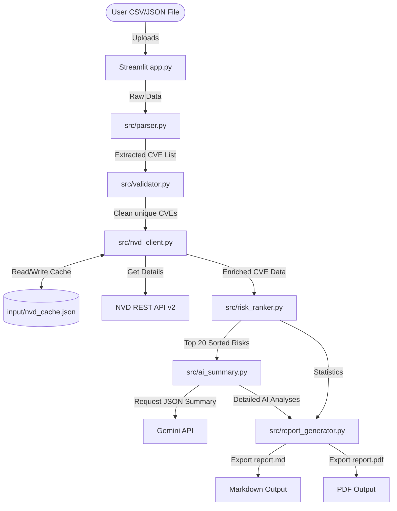

# Project Architecture Documentation

This document describes the architectural layout, modules, data flows, and design decisions of the Patch/Vulnerability Report Builder.

## 1. System Components

The application is built using a clean, modular Python backend and a Streamlit frontend.

### Module Responsibilities:

1. **`app.py` (Streamlit Dashboard)**:
   - Manages user sessions, inputs, configurations (API keys, models).
   - Coordinates execution across backend modules.
   - Renders KPIs, Plotly visualizations, interactive data tables, tabs, and downloads.

2. **`src/parser.py` (File Parsing)**:
   - Extracts potential CVE strings from uploaded CSV and JSON files.
   - Employs a regex-based fallback scanner if standard schema keys (e.g. `CVE_ID`, `cve`) are missing.

3. **`src/validator.py` (Vulnerability Validation)**:
   - Validates CVE format using strict regex (`^CVE-\d{4}-\d{4,7}$`).
   - Standardizes characters to uppercase and deduplicates inputs.

4. **`src/nvd_client.py` (NVD Integration & Cache)**:
   - Interfaces with the public NVD API.
   - Utilizes `input/nvd_cache.json` to store fetched CVE data, saving network calls and respecting rate limits.
   - Standardizes responses into a unified dictionary structure.

5. **`src/risk_ranker.py` (Risk Categorization & Sorting)**:
   - Computes severity groups based on CVSS scores.
   - Sorts vulnerabilities by CVSS descending (and CVE ID descending as tie-breaker).
   - Produces dataset counts and pulls the Top 20 records.

6. **`src/ai_summary.py` (LLM Analysis Engine)**:
   - Sets up Google Generative AI connections.
   - Requests structured JSON responses for per-CVE assessments and markdown for executive summaries.
   - Implements robust static backups to maintain system operations when offline.

7. **`src/report_generator.py` (Document Exports)**:
   - Formats scan stats and AI logs into markdown.
   - Uses `fpdf2` to build printable PDF reports with tables, bold headers, and styled left-border card calls.

8. **`src/charts.py` (Visualizations)**:
   - Generates Plotly charts (donuts and bars) using cohesive, high-contrast severity colors.

---

## 2. Key Design Decisions

### Disk Caching
To speed up local development and evaluation scans, the `NVDClient` automatically caches enriched CVE records. This is vital because the public NVD API has low rate limits (requests are throttled heavily without an API key).

### Resilient Mock Backups
Both the NVD API client and the Gemini AI summary engine contain robust fallback/mock logic. If network connections fail or API keys are invalid, the app automatically transitions to generating high-quality placeholder security metrics. This ensures the dashboard works "out of the box" for evaluators who may not have active API credentials on hand.

### Safe PDF Character Mapping
Standard Helvetica fonts in PDFs fail when encountering Unicode sequences like smart quotes or bullet points. The `report_generator` implements Latin-1 character mapping replacement filters to ensure report generation remains completely stable.
